# MCP AI Agent with Google ADK, Google Maps, and Opik
<p align="left">
  
  
  
  
  
</p>
This project demonstrates the creation of an <b>AI Agent</b> using the <b>Google Agent Development Kit (ADK)</b>, <b>OpenAI's GPT-4o model</b>, the <b>Google Maps MCP Server</b>, and <b>Opik</b> for observability with <b>Comet.ml</b>.

The primary goal of this project is to deepen my understanding of <b>Agent Development principles</b>, the application of the Model Context Protocol in practice, and how to integrate its tools and services into an <b>AI Agent</b> for enhanced abilities
beyond the training data.


This project is largely inspired by Santiago Valdarrama's tutorial on YouTube:
*   **Video:** [Building AI Agents with Google's Agent Development Kit (ADK)](https://www.youtube.com/watch?v=lstUnckxfs0)
*   **Repo:** [svpino/google-adk-sample](https://github.com/svpino/google-adk-sample)

## Table of Contents

-   [Key Technologies](#key-technologies)
    *   [Google Agent Development Kit (ADK)](#google-agent-development-kit-adk)
    *   [Opik & CometML](#opik--cometml)
    *   [Model Context Protocol (MCP)](#model-context-protocol-mcp)
    *   [Google Maps MCP Server](#google-maps-mcp-server)
-   [Project Structure](#project-structure)
-   [Project Setup and Installation](#project-setup-and-installation)
    *   [Prerequisites](#prerequisites)
    *   [Installation Steps](#installation-steps)
    *   [Environment Variables](#environment-variables)
    *   [Running the Agent](#running-the-agent)
-   [Screenshots & Usage](#screenshots--usage)
    *   [ADK Web UI](#adk-web-ui)
    *   [Agent Using Tools (Directions)](#agent-using-tools)
    *   [Conversation Events & Tool Graph](#conversation-events--tool-invocation)
    *   [Opik (CometML) Tracing](#opik-cometml-tracing)
-   [Code Deep Dive (`agent.py`)](#code-deep-dive-agentpy)
    *   [Imports and Setup](#imports-and-setup)
    *   [Agent Definition](#agent-definition)
    *   [MCP Toolset Configuration](#mcp-toolset-configuration)
    *   [Opik Tracing Callbacks](#opik-tracing-callbacks)
-   [Author](#author)
-   [License](#license)

## Key Technologies

### Google Agent Development Kit (ADK)
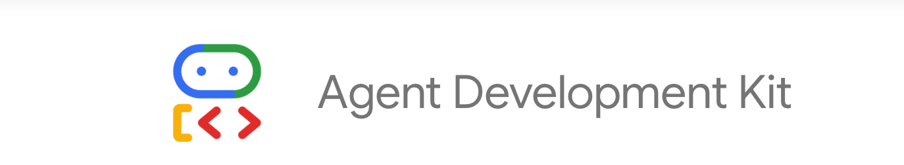

The [Google Agent Development Kit (ADK)](https://google.github.io/adk-docs/) is a Python framework designed to simplify the development of <b>AI Agents</b> powered by LLMs. It provides access to <b>tools</b>, <b>memory</b>, <b>agent orchestration</b> and LLMs from providers like OpenAI, Anthropic, Cohere and many others through integration with the `LiteLlm` library. The ADK also includes a <b>web UI</b> for interacting with and debugging agents.

### Opik & CometML

[Opik](https://github.com/comet-ml/opik) is an open-source observability solution for LLM applications, built by Comet. It allows you to <b>trace</b>, <b>visualize</b>, and <b>debug</b> the interactions within your AI Agents, including <b>LLM calls</b>, <b>tool usage</b>, and other operations.
In this project, Opik is configured to send traces to [CometML](https://www.comet.com/), providing a rich UI to inspect agent behavior.

### Model Context Protocol (MCP)
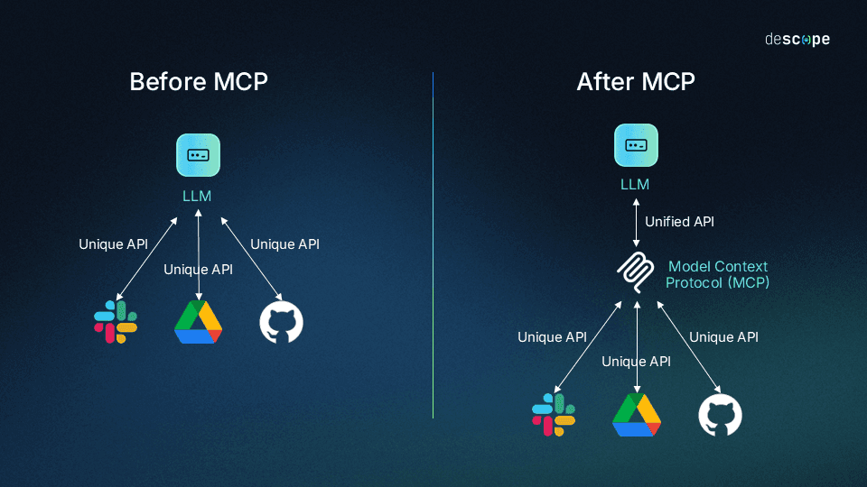

The [Model Context Protocol (MCP)](https://modelcontextprotocol.io/introduction) is an open protocol that standardizes how applications provide context to LLMs and connect them to different <b>data sources</b> and <b>tools</b>. It defines a schema for <b>tool descriptions</b>, <b>invocations</b>, and <b>responses</b>. This allows for interoperability between different LLM systems and tool providers.

### Google Maps MCP Server

The [Google Maps MCP Server](https://apidog.com/blog/google-maps-mcp-server/) is a Node.js application that exposes Google Maps Platform APIs as MCP tools. This allows an <b>ADK Agent</b> to easily leverage Google Maps features to deliver more relevant, context-aware responses.

*   **How it runs:** The ADK's `MCPToolset` can automatically start this server using `npx` if it's not already running, as configured in this project.
*   **Main Tools Exposed:**
    *   `maps_directions`: Get driving, walking, or cycling directions.
    *   `maps_geocode`: Convert addresses to geographic coordinates.
    *   `maps_reverse_geocode`: Convert geographic coordinates to addresses.
    *   `maps_elevation`: Get elevation for a given coordinate.
    *   `maps_search_places`: Search for places (e.g., restaurants, landmarks).
    *   `maps_place_details`: Get detailed information about a specific place.
    *   `maps_distance_matrix`: Calculate travel time and distance between multiple origins and destinations.

## Project Structure
```
.
├── assets
│   └── screenshots
│       ├── interface.png
│       ├── maps_direction_tool_input_output.png
│       ├── maps_direction_tool_opik.png
│       ├── maps_direction_tool.png
│       ├── maps_directions_tool_events.png
│       ├── maps_elevation_tool.png
│       ├── maps_place_details_event.png
│       ├── maps_reverse_geocode_event.png
│       ├── opik_overall_input_output.png
|       ├── adk.png
|       ├── mcp.png
│       └── opik_traces.png
├── examples
│   └── agent_conversation.yaml
├── LICENSE
├── mcp_agent
│   ├── __init__.py
│   └── agent.py
├── pyproject.toml
├── README.md
└── uv.lock
```

## Project Setup and Installation

### Prerequisites

*   Python 3.11
*   [uv](https://github.com/astral-sh/uv) (Python package and virtual environment manager)
*   [Node.js](https://nodejs.org/en) and [npm](https://www.npmjs.com/) / [npx](https://www.npmjs.com/package/npx) (required to run the Google Maps MCP Server, which the ADK will start via `npx`)
*   A Google Maps Platform API Key?
*   An OpenAI API Key.
*   CometML API Key, Project ID, and Workspace.

### Installation Steps

1.  **Clone the repository:**
    ```bash
    git clone https://github.com/luuisotorres/mcp-ai-agent.git
    cd mcp-ai-agent
    ```

2.  **Create and sync the virtual environment using UV:**
    ```bash
    uv venv  # Create a virtual environment (e.g., .venv)
    uv sync  # Install dependencies from pyproject.toml
    source .venv/bin/activate # Or `.\.venv\Scripts\activate` on Windows
    ```

3.  **Set up environment variables:**
    Copy the example environment file and fill in your credentials:
    ```bash
    cp .env.example .env
    ```
    Then, edit `.env` with your actual API keys.

### Environment Variables

```bash
GOOGLE_MAPS_PLATFORM_API_KEY="your-google-maps-api-key"
OPENAI_API_KEY="your-openai-api-key"
COMET_API_KEY="your-comet-api-key"
COMET_WORKSPACE="your-comet-workspace"
COMET_PROJECT_NAME="your-comet-project-name"
```

The `.env` file should contain:

*   `GOOGLE_MAPS_PLATFORM_API_KEY`: Your Google Maps Platform API key.
    *   _Purpose:_ Allows the Google Maps MCP Server to make requests to Google Maps APIs.
*   `OPENAI_API_KEY`: Your OpenAI API key.
    *   _Purpose:_ Allows the `LiteLlm` model to use OpenAI's GPT models.
*   `COMET_API_KEY`: Your CometML API Key.
    *   _Purpose:_ For Opik to send traces to your CometML project.
*   `COMET_WORKSPACE`: Your CometML workspace.
*   `COMET_PROJECT_NAME`: The CometML project name where traces will be stored.


### Running the Agent

Once the setup is complete, run the ADK web UI:

```bash
uv run adk web
```

This command will:
1.  Start a FastAPI server.
2.  Provide a web interface at `http://127.0.0.1:8000` to interact with your agent.
3.  The `MCPToolset` in `agent.py` is configured to start the Google Maps MCP server via `npx` automatically when the agent needs to use its tools.

## Screenshots & Usage

### ADK Web UI

Upon running `uv run adk web` and navigating to `http://127.0.0.1:8000` (or the port shown in your terminal), you'll see the ADK Web UI. You can select your Agent, in this case `mcp_agent`, and start a conversation.

*(Screenshot 1: The initial ADK Web UI screen with the chat input.)*
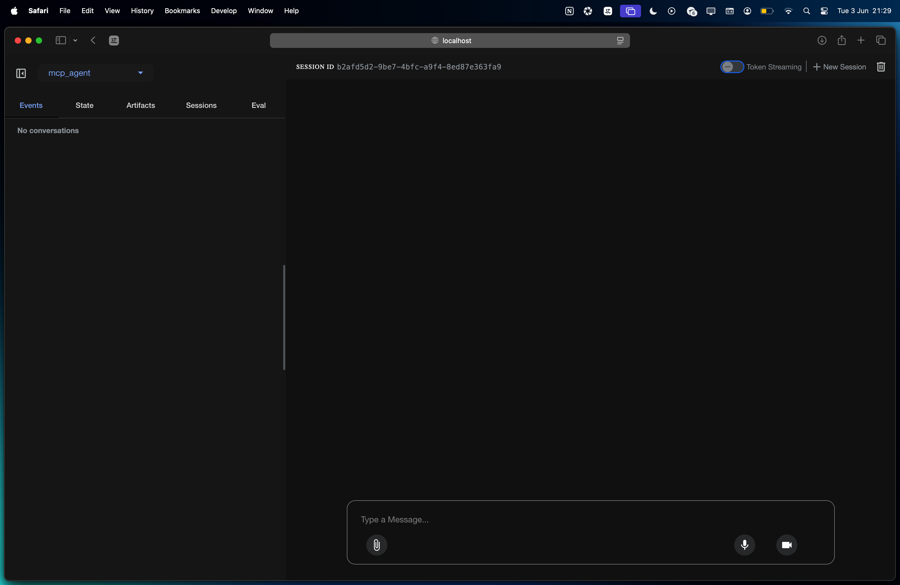
*Caption: The main interface of the ADK Web UI where you can type messages to your agent.*

### Agent Using Tools

The agent can understand requests for directions, place details, elevation, and more, using the <b>tools</b> from the <b>Google Maps MCP Server</b>.

**Example: Getting Directions**
The agent responds to "How do I drive from São Paulo to Campinas?" with turn-by-turn directions.

*(Screenshot 2: Agent using the `maps_directions` tool.)*
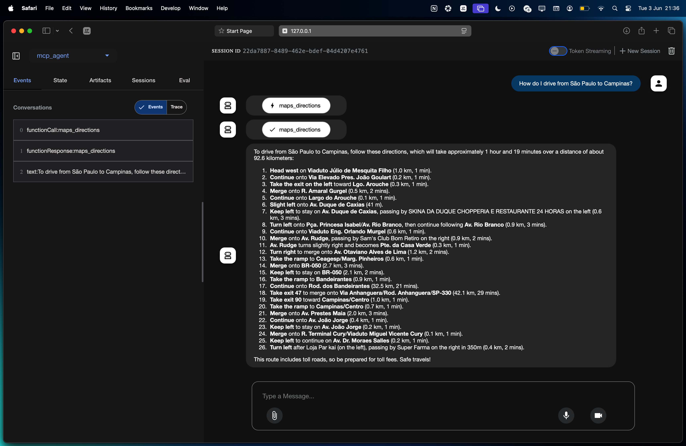
*Caption: The agent successfully uses the `maps_directions` tool to provide driving directions in the chat interface.*

**Example: Getting Place Details**
The agent can fetch reviews and other information for landmarks.

*(Screenshot 3: Agent using `maps_place_details` for Eiffel Tower reviews.)*
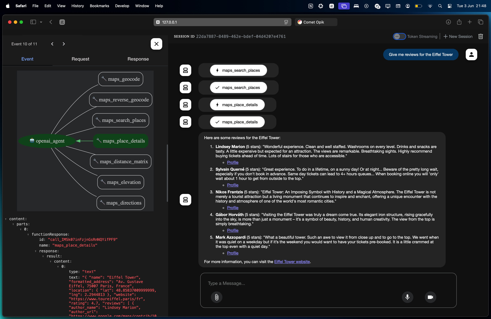
*Caption: Agent fetching and displaying reviews for the Eiffel Tower, showcasing the `maps_place_details` tool usage and output.*

**Example: Getting Elevation**
The agent can provide elevation for given coordinates.

*(Screenshot 4: Agent using `maps_elevation` tool.)*
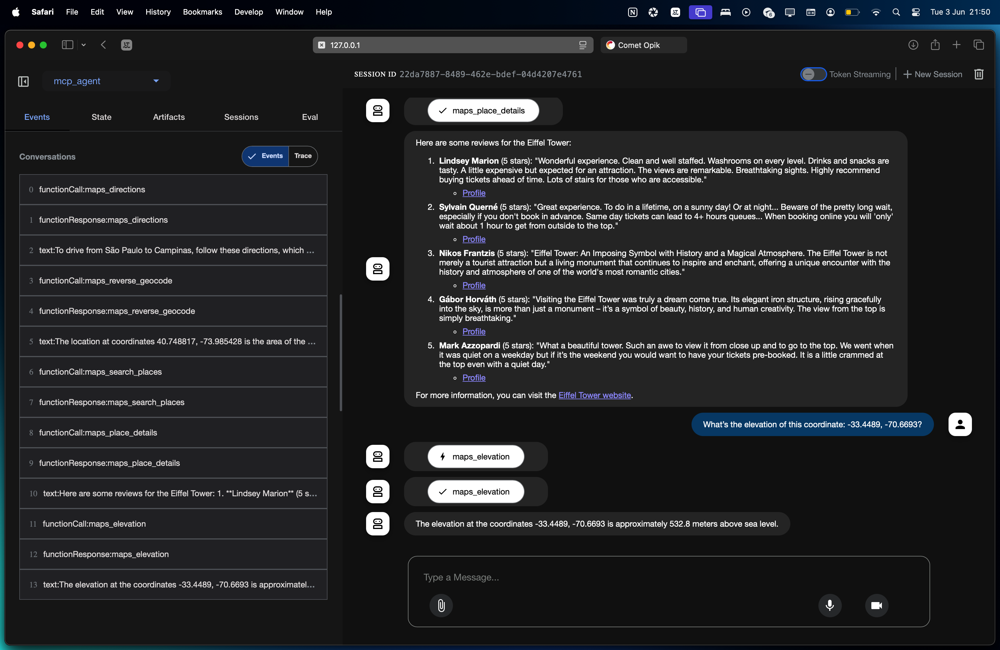
*Caption: Agent providing the elevation for specified coordinates using the `maps_elevation` tool.*

### Conversation Events & Tool Invocation

The ADK Web UI provides an "Events" (or "Trace") tab where you can inspect the flow of the conversation. This includes the function calls made by the agent and the responses received from tools.

**Example: `maps_reverse_geocode` Event**
Shows the agent invoking the `maps_reverse_geocode` tool.

*(Screenshot 5: Event view for `maps_reverse_geocode`.)*
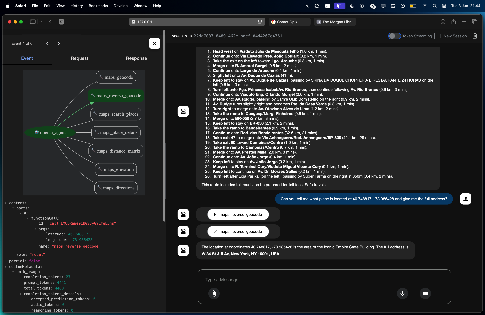
*Caption: Event view detailing a `functionCall` for `maps_reverse_geocode` with `args` and Metadata.*

**Example: `maps_directions` Event Flow**
Illustrates the sequence of events when the `maps_directions` tool is called.

*(Screenshot 6: Event view for `maps_directions` tool.)*
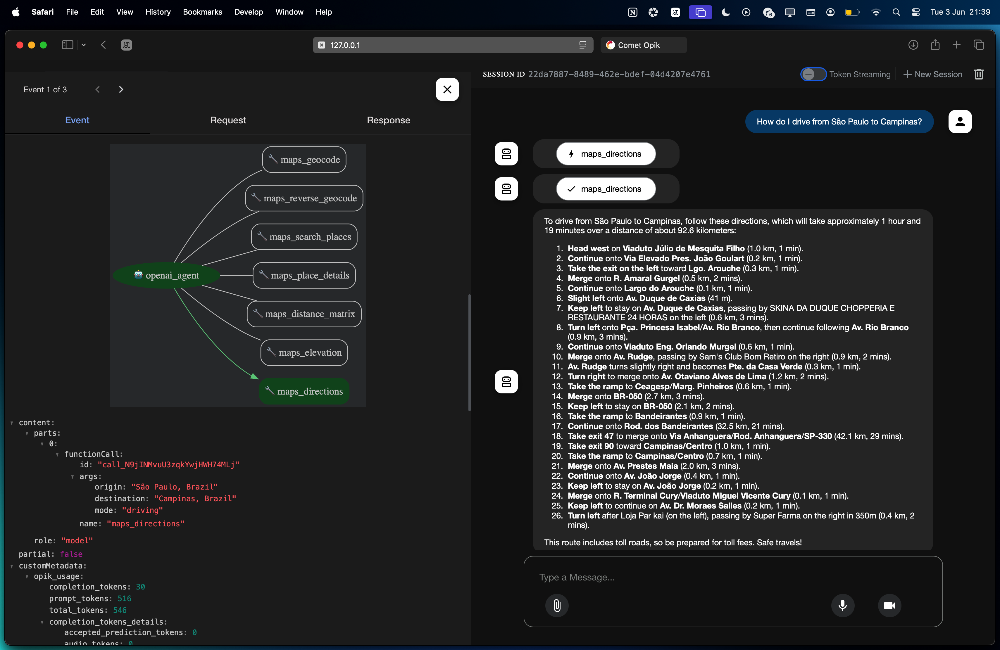
*Caption: The "Events" tab in the ADK UI, showing the invocation details for the `maps_directions` tool.*

### Opik (CometML) Tracing

Opik integrates with CometML to provide detailed traces of your agent's execution, offering insights into LLM calls, tool usage, and overall performance.

**Overall Traces in Opik**
A list of all captured interactions for the project.

*(Screenshot 7: Overview of traces in CometML for the `mcp-ai-agent` project.)*
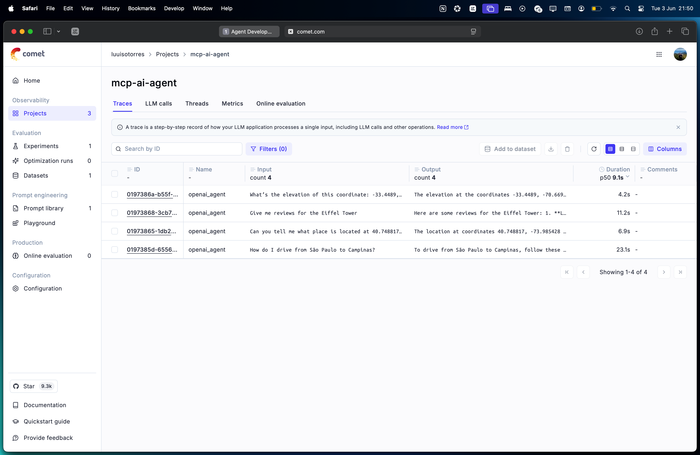
*Caption: The CometML UI showing a list of traces captured by Opik for different agent interactions.*

**Detailed Opik Trace for `maps_direction_tool`**
A specific trace showing the LLM call and the `maps_direction_tool` invocation.

*(Screenshot 8: Detailed view of a single trace involving the `maps_directions` tool.)*
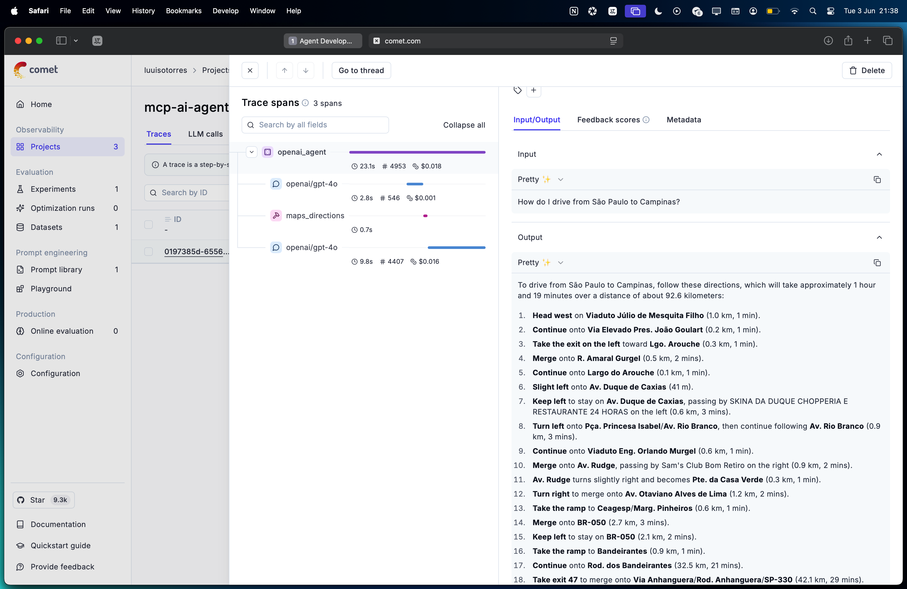
*Caption: A detailed view of an Opik trace in CometML, showing the sequence of operations for a `maps_directions` request, including the LLM call and tool interaction.*

**Input/Output YAML in Opik**
Detailed request and response data for LLM calls and tool interactions, presented in YAML.

*(Screenshot 9: Input/Output details for the `maps_direction` tool call in Opik.)*
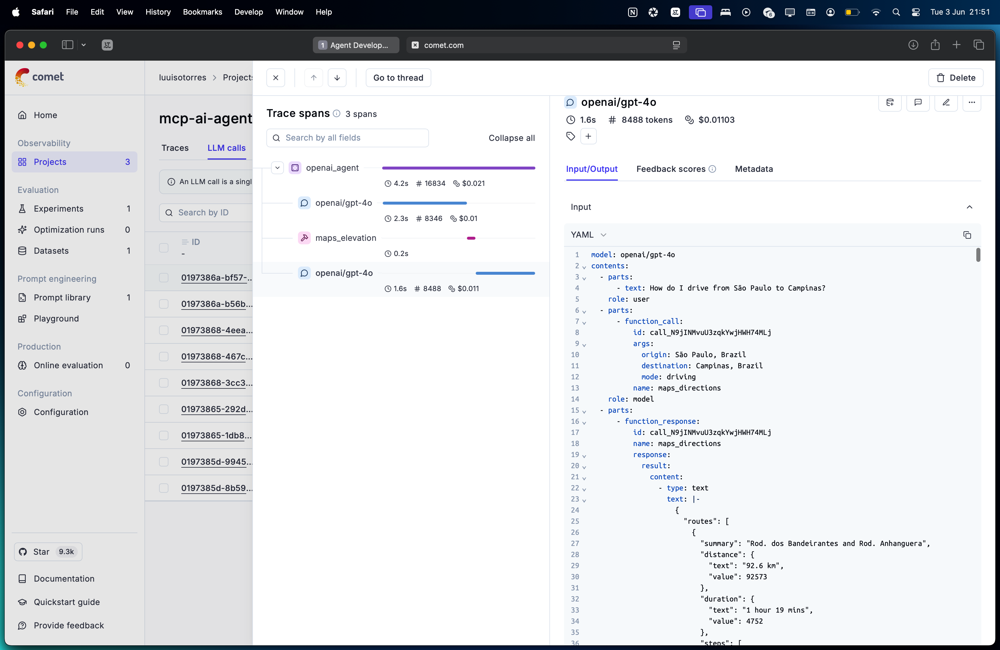
*Caption: The Input/Output tab within an Opik trace in CometML, displaying the request and response of the entire conversation in YAML format.*

These traces are invaluable for debugging, understanding agent behavior, and optimizing performance.

<b><i>Note:</i></b> You can find the entire YAML file for this conversation at `examples/agent_conversation.yaml`


## Code Deep Dive (`agent.py`)

### Imports and Setup

We begin by importing the required packages for ADK, environment configuration, and observability:

```python
from google.adk.agents import LlmAgent
from google.adk.models.lite_llm import LiteLlm
from google.adk.tools.mcp_tool.mcp_toolset import (
    MCPToolset,
    StdioServerParameters
)
import os
from dotenv import load_dotenv
import opik
from opik.integrations.adk import OpikTracer
```

This sets the foundation for the agent logic.

### Environment Configuration

Here we load API keys and configure observability:

```python
load_dotenv()
opik.configure(use_local=False)
tracer = OpikTracer()
GOOGLE_MAPS_API_KEY = os.getenv("GOOGLE_MAPS_PLATFORM_API_KEY")
```

### Agent Definition

We initialize an <b>ADK Agent</b> with `LlmAgent` using OpenAI's GPT-4o model and the `LiteLlm` library for ADK <> OpenAI integration:

```python
root_agent = LlmAgent(
    model=LiteLlm(model="openai/gpt-4o"),
    name="openai_agent",
    description="An intelligent mapping assistant that provides driving, walking, and public transportation directions...",
    instruction="When the user asks for routes, travel times, or directions between locations..."
```

### Tool Configuration

This is where we define the integration with the <b>Google Maps MCP Server</b>:

```python
tools=[
    MCPToolset(
        connection_params=StdioServerParameters(
            command="npx",
            args=[
                "-y",
                "@modelcontextprotocol/server-google-maps"
            ],
            env={
                "GOOGLE_MAPS_API_KEY": GOOGLE_MAPS_API_KEY
            },
        ),
    )
],
```

This tells the agent to launch the MCP server using `npx`, making all Google Maps tools available for our Agent.

### Observability Callbacks

Finally, we attach Opik tracing callbacks to capture the full agent lifecycle:

```python
before_agent_callback=tracer.before_agent_callback,
after_agent_callback=tracer.after_agent_callback,
before_model_callback=tracer.before_model_callback,
after_model_callback=tracer.after_model_callback,
before_tool_callback=tracer.before_tool_callback,
after_tool_callback=tracer.after_tool_callback,
)
```

This enables deep visibility into every interaction handled by the agent.


## Author
[Luis Fernando Torres](https://github.com/luuisotorres)

[](https://www.linkedin.com/in/luuisotorres/)
[](https://medium.com/@luuisotorres)
[](https://www.kaggle.com/lusfernandotorres)
[](https://huggingface.co/luisotorres)

## License

This project is licensed under the MIT License. See the [LICENSE](LICENSE) file for details.